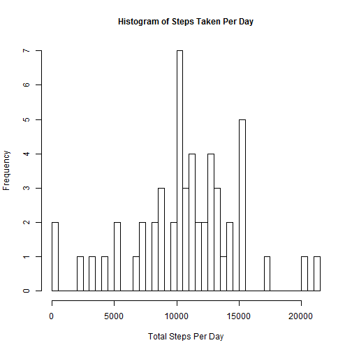
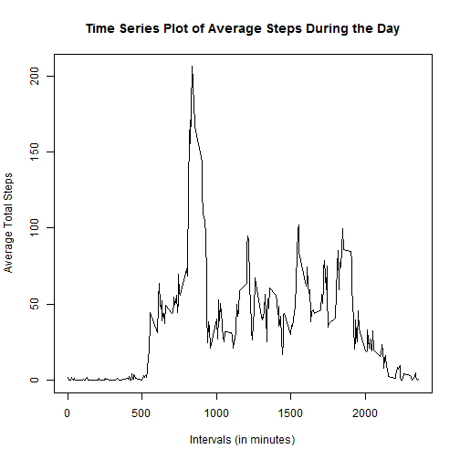
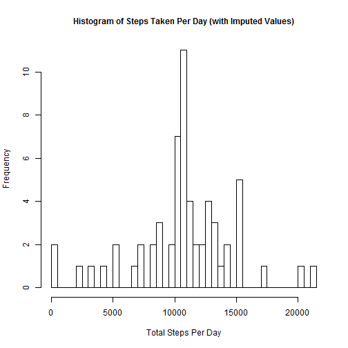

The data for this assignment can be downloaded from the course web site:

Dataset: Activity monitoring data [52K] 
https://d396qusza40orc.cloudfront.net/repdata%2Fdata%2Factivity.zip

The variables included in this dataset are:

steps: Number of steps taking in a 5-minute interval (missing values are coded as NA)
date: The date on which the measurement was taken in YYYY-MM-DD format
interval: Identifier for the 5-minute interval in which measurement was taken

The dataset is stored in a comma-separated-value (CSV) file and there are a total of 17,568 observations in this dataset.

**Part 1: Loading and preprocessing the data**

*Part 1A. Show any code that is needed to load the data (i.e. read.csv())*

```r
setwd("~/Coursera/Reproducible Research")
activitymonitoringdata <- read.csv("~/Coursera/Reproducible Research/activity.csv", na.strings=c("", "NA"), stringsAsFactors = FALSE)
```

*Part 1B. Process/transform the data (if necessary) into a format suitable for your analysis*

```r
summary(activitymonitoringdata)
```

```
##      steps            date              interval     
##  Min.   :  0.00   Length:17568       Min.   :   0.0  
##  1st Qu.:  0.00   Class :character   1st Qu.: 588.8  
##  Median :  0.00   Mode  :character   Median :1177.5  
##  Mean   : 37.38                      Mean   :1177.5  
##  3rd Qu.: 12.00                      3rd Qu.:1766.2  
##  Max.   :806.00                      Max.   :2355.0  
##  NA's   :2304
```
Code above show that the "date" variable needs to be transformed from factor in date format. "Steps" and "interval" are in the right data format (integer).

```r
activitymonitoringdata$date <- as.Date(activitymonitoringdata$date)
```

**Part 2. What is mean total number of steps taken per day?**

For this part of the assignment, you can ignore the missing values in the dataset.
 
*Part 2A. Make a histogram of the total number of steps taken each day*

```r
summarysteps <- aggregate(activitymonitoringdata$steps, by = list(activitymonitoringdata$date), FUN = "sum")
colnames(summarysteps) <- c("Date", "TotalSteps")
hist(summarysteps$TotalSteps, breaks = 50, main = "Histogram of Steps Taken Per Day", cex.main = 1, xlab = "Total Steps Per Day")
```

 

*Part 2B. Calculate and report the mean and median total number of steps taken per day*

```r
mean(summarysteps$TotalSteps, na.rm = TRUE)
```

```
## [1] 10766.19
```

```r
median(summarysteps$TotalSteps, na.rm = TRUE)
```

```
## [1] 10765
```
The mean total number of steps taken per day is ~10,766, and the median is ~10,765. 

**Part 3. What is the average daily activity pattern?**

*Part 3A. Make a time series plot (i.e. type = "l") of the 5-minute interval (x-axis) and the average number of steps taken, averaged across all days (y-axis).*

```r
timeseries <- aggregate(activitymonitoringdata$steps, by = list(activitymonitoringdata$interval), FUN = mean, na.rm = TRUE)
colnames(timeseries) <- c("Interval", "AverageSteps")

plot(timeseries$Interval, timeseries$AverageSteps, main = "Time Series Plot of Average Steps During the Day", type="l", col = "black", xlab = "Intervals (in minutes)", ylab = "Average Total Steps")
```

 

*Part 3B.  Which 5-minute interval, on average across all the days in the dataset, contains the maximum number of steps?*

```r
timeseries$Interval[which(timeseries$AverageSteps %in% max(timeseries$AverageSteps))]
```

```
## [1] 835
```

```r
max(timeseries$AverageSteps)
```

```
## [1] 206.1698
```
The time interval 835 (interpreted as around 13.9 military time, or around 1:54pm) contains on average the maximum average number of steps at 206 steps.

**Part 4. Imputing missing values**

Note that there are a number of days/intervals where there are missing values (coded as NA). The presence of missing days may introduce bias into some calculations or summaries of the data.

*Part 4A. Calculate and report the total number of missing values in the dataset (i.e. the total number of rows with NAs)*

```r
dim(activitymonitoringdata[!complete.cases(activitymonitoringdata),])
```

```
## [1] 2304    3
```

```r
length(unique(activitymonitoringdata$date[which(is.na(activitymonitoringdata))]))
```

```
## [1] 8
```
There are a total of 2304 rows with missing data, spanning across 8 unique days.

*Part 4B + 4C. Devise a strategy for filling in all of the missing values in the dataset. The strategy does not need to be sophisticated. For example, you could use the mean/median for that day, or the mean for that 5-minute interval, etc.Create a new dataset that is equal to the original dataset but with the missing data filled in.*

Imputing strategy is to fill in missing values with the average values of steps for that time interval.

```r
activitymonitoringdata$impsteps <- 0
activitymonitoringdata$impsteps <- timeseries$AverageSteps[match(activitymonitoringdata$interval, timeseries$Interval)]
activitymonitoringdata$steps[is.na(activitymonitoringdata$steps)] <- activitymonitoringdata$impsteps[is.na(activitymonitoringdata$steps)]
activitymonitoringdata2 <- activitymonitoringdata[, 1:3]
```
New dataset is called "activitymonitoringdata2".

*Part 4D. Make a histogram of the total number of steps taken each day and Calculate and report the mean and median total number of steps taken per day. Do these values differ from the estimates from the first part of the assignment? What is the impact of imputing missing data on the estimates of the total daily number of steps?*

```r
summarysteps2 <- aggregate(activitymonitoringdata2$steps, by = list(activitymonitoringdata2$date), FUN = "sum")
colnames(summarysteps2) <- c("Date", "TotalSteps")
hist(summarysteps2$TotalSteps, breaks = 50, main = "Histogram of Steps Taken Per Day (with Imputed Values)", cex.main = 1, xlab = "Total Steps Per Day")
```

 

```r
mean(summarysteps2$TotalSteps, na.rm = TRUE)
```

```
## [1] 10766.19
```

```r
median(summarysteps2$TotalSteps, na.rm = TRUE)
```

```
## [1] 10766.19
```
The new mean and median steps per day are respectively ~10,766, and ~10,766. The numbers are very similar to non-imputed values, with the imputed median step 1 day above the non-imputed median step (answer to part 2B). This shows that the imputing strategy may have slightly inflated the median number of steps taken and did not impact average/median values significantly. 

**Part 5: Are there differences in activity patterns between weekdays and weekends?**

For this part the weekdays() function may be of some help here. Use the dataset with the filled-in missing values for this part.

*Part 5A. Create a new factor variable in the dataset with two levels - "weekday" and "weekend" indicating whether a given date is a weekday or weekend day.*

```r
activitymonitoringdata2$weekday <- weekdays(activitymonitoringdata2$date)
activitymonitoringdata2$weekdayind <- "weekday"
activitymonitoringdata2$weekdayind[which(activitymonitoringdata2$weekday %in% c("Saturday", "Sunday"))] <- "weekend"
activitymonitoringdata2$weekdayind <- as.factor(activitymonitoringdata2$weekdayind)
```

*Part 5B. Make a panel plot containing a time series plot (i.e. type = "l") of the 5-minute interval (x-axis) and the average number of steps taken, averaged across all weekday days or weekend days (y-axis). See the README file in the GitHub repository to see an example of what this plot should look like using simulated data.*

```r
library(reshape2)
library(lattice)

timeseries2 <- aggregate(activitymonitoringdata2$steps, by = c(list(activitymonitoringdata2$interval), list(activitymonitoringdata2$weekdayind)), FUN = sum)
colnames(timeseries2) <- c("Interval", "Weekday", "AverageSteps")
timeseries3 <- dcast(timeseries2, Interval ~ Weekday)
```

```
## Using AverageSteps as value column: use value.var to override.
```

```r
xyplot(weekday + weekend ~ Interval, data = timeseries3, layout = c(1,2), type = "l", outer = TRUE)
```

 
